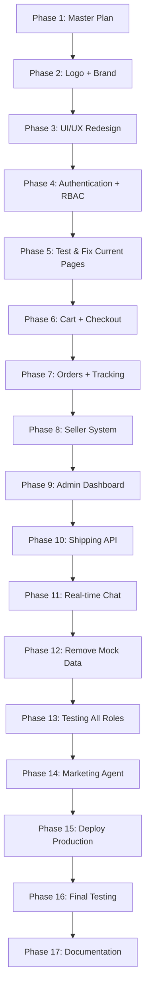
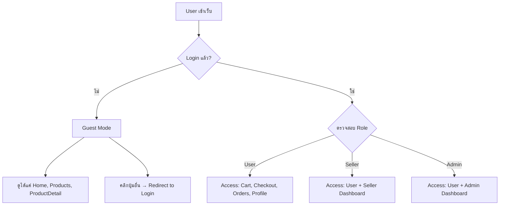

# 🚀 StreetMarket E-commerce Marketplace - Master Plan

**Project Goal:** สร้าง E-commerce Marketplace แบบ Production-Ready สไตล์ Dark/Underground สำหรับวัยรุ่น 15-27 ปี พร้อมระบบครบถ้วน

**Timeline:** Continuous development until 100% complete
**Token Limit:** NO LIMIT (เพิ่มจาก 200K)

---

## 📊 Current Status (Phase 1)

### ✅ Completed (30%)
- [x] Database Schema (14 tables) with Supabase PostgreSQL
- [x] Basic Backend API (56 endpoints)
- [x] Home page (แสดงสินค้า 8 รายการ)
- [x] Products page (ค้นหา, กรอง, เรียงลำดับ)
- [x] ProductDetail page (รีวิว, เพิ่มตะกร้า)
- [x] Dark theme UI (พื้นฐาน)
- [x] GitHub + Vercel auto-deploy

### ❌ Missing (70%)
- [ ] Logo ใหม่สไตล์ Hardcore Dark Underground
- [ ] UI/UX เอกลักษณ์วัยรุ่นฮาร์ดคอร์
- [ ] Authentication + Role-Based Access Control
- [ ] Cart + Checkout (PromptPay QR)
- [ ] Orders + Tracking
- [ ] Seller Registration + Dashboard
- [ ] Admin Dashboard (ครบถ้วน)
- [ ] Real-time Chat
- [ ] Shipping API Integration (4 ค่าย)
- [ ] Marketing Agent อัตโนมัติ
- [ ] ตัด Mock data ออกทั้งหมด
- [ ] Testing ทุก Role แบบเข้มงวด

---

## 🎯 Phase 1: วิเคราะห์และสร้าง Master Plan

### 1.1 วิเคราะห์ระบบปัจจุบัน
**Files ที่มีอยู่:**
- Database: 14 tables (users, sellers, products, categories, reviews, cart_items, orders, order_items, transactions, messages, disputes, notifications, wishlist, withdrawal_requests)
- Backend: server/db.ts (60+ functions)
- Frontend: 16 pages (Home, Products, ProductDetail, Cart, Checkout, Orders, Profile, Seller*, Admin*, Chat, etc.)
- Components: Header, Footer, UI components (shadcn/ui)

**ปัญหาที่พบ:**
1. ❌ ไม่มี Authentication จริง (ใช้ Mock user)
2. ❌ ไม่มี Role-Based Access Control
3. ❌ Cart, Checkout, Orders ยังไม่ทำงาน
4. ❌ Seller Dashboard ยังไม่สมบูรณ์
5. ❌ Admin Dashboard ยังไม่สมบูรณ์
6. ❌ ไม่มี Real-time Chat
7. ❌ ไม่มี Shipping API Integration
8. ❌ UI/UX ดูธรรมดา ไม่มีเอกลักษณ์
9. ❌ Logo ยังไม่ตรงกับสไตล์ Hardcore Dark Underground

### 1.2 กำหนด Workflow อัตโนมัติ



### 1.3 กำหนด Testing Strategy

**Testing Matrix:**
| Role | Access Level | Test Cases |
|------|-------------|------------|
| **Guest (ไม่ Login)** | - ดูหน้า Home<br>- ดูหน้า Products<br>- ดูหน้า ProductDetail<br>- **ไม่สามารถ**: Cart, Checkout, Orders, Profile, Seller, Admin | 15 test cases |
| **User (Login แล้ว)** | - ทุกอย่างของ Guest<br>- Cart, Checkout, Orders<br>- Profile, Wishlist<br>- Chat with Seller/Admin<br>- **ไม่สามารถ**: Seller Dashboard, Admin Dashboard | 30 test cases |
| **Seller (อนุมัติแล้ว)** | - ทุกอย่างของ User<br>- Seller Dashboard<br>- จัดการสินค้า<br>- จัดการคำสั่งซื้อ<br>- **ไม่สามารถ**: Admin Dashboard | 25 test cases |
| **Admin** | - ทุกอย่างของ User<br>- Admin Dashboard<br>- อนุมัติ Seller<br>- จัดการสินค้าทั้งหมด<br>- จัดการคำสั่งซื้อทั้งหมด<br>- จัดการข้อพิพาท<br>- ตอบแชทปัญหา | 40 test cases |

**Total Test Cases:** 110+

---

## 🎨 Phase 2: สร้าง Logo และปรับ Brand Identity

### 2.1 Logo Requirements
**Style:** Hardcore Dark Underground
**Theme:** 
- สีดำเป็นหลัก
- Neon effects (แดงสด, เขียวนีออน, ส้มทอง)
- Typography: Bold, Edgy, Street style
- Elements: Graffiti, Tattoo, Underground culture

**Text:** "dLNk Dark Shop"

**Deliverables:**
- Logo PNG (1024x1024, transparent background)
- Logo variations (horizontal, vertical, icon only)
- Favicon (32x32, 64x64, 128x128)

### 2.2 Brand Identity
**Color Palette:**
- Primary: `#FF0000` (แดงสด)
- Secondary: `#00FF00` (เขียวนีออน)
- Accent: `#FF6600` (ส้มทอง)
- Background: `#0A0A0A` (ดำสนิท)
- Surface: `#1A1A1A` (เทาเข้ม)
- Text: `#FFFFFF` (ขาว)

**Typography:**
- Headings: "Bebas Neue" (Bold, Uppercase)
- Body: "Inter" (Regular, Medium)
- Accent: "Permanent Marker" (สำหรับ Graffiti style)

**Effects:**
- Neon glow (box-shadow)
- Glass morphism
- Gradient overlays
- Scan lines (CRT effect)

---

## 🎨 Phase 3: ปรับ UI/UX Components

### 3.1 Button Styles
**Current:** ธรรมดา, ไม่มีเอกลักษณ์
**New Design:**
```css
/* Primary Button - Neon Red */
.btn-primary {
  background: linear-gradient(135deg, #FF0000, #CC0000);
  box-shadow: 0 0 20px rgba(255, 0, 0, 0.5);
  border: 2px solid #FF0000;
  text-transform: uppercase;
  font-weight: bold;
  letter-spacing: 2px;
  transition: all 0.3s;
}

.btn-primary:hover {
  box-shadow: 0 0 40px rgba(255, 0, 0, 0.8);
  transform: translateY(-2px);
}

/* Secondary Button - Neon Green */
.btn-secondary {
  background: linear-gradient(135deg, #00FF00, #00CC00);
  box-shadow: 0 0 20px rgba(0, 255, 0, 0.5);
}

/* Accent Button - Neon Orange */
.btn-accent {
  background: linear-gradient(135deg, #FF6600, #CC5200);
  box-shadow: 0 0 20px rgba(255, 102, 0, 0.5);
}
```

### 3.2 Card Styles
**Current:** ธรรมดา, border เรียบ
**New Design:**
```css
.card-dark {
  background: rgba(26, 26, 26, 0.8);
  border: 2px solid rgba(255, 0, 0, 0.3);
  border-radius: 12px;
  backdrop-filter: blur(10px);
  box-shadow: 0 8px 32px rgba(0, 0, 0, 0.5);
  position: relative;
  overflow: hidden;
}

.card-dark::before {
  content: '';
  position: absolute;
  top: 0;
  left: -100%;
  width: 100%;
  height: 100%;
  background: linear-gradient(90deg, transparent, rgba(255, 0, 0, 0.3), transparent);
  transition: 0.5s;
}

.card-dark:hover::before {
  left: 100%;
}
```

### 3.3 Input Styles
**Current:** ธรรมดา
**New Design:**
```css
.input-dark {
  background: rgba(26, 26, 26, 0.8);
  border: 2px solid rgba(255, 0, 0, 0.3);
  color: #FFFFFF;
  padding: 12px 16px;
  border-radius: 8px;
  transition: all 0.3s;
}

.input-dark:focus {
  border-color: #FF0000;
  box-shadow: 0 0 20px rgba(255, 0, 0, 0.3);
  outline: none;
}
```

### 3.4 Navigation Styles
**Current:** ธรรมดา
**New Design:**
- Sticky header with blur effect
- Neon underline on hover
- Shopping cart icon with badge (neon glow)
- User avatar with neon border

### 3.5 Product Card Styles
**Current:** ธรรมดา
**New Design:**
- Hover effect: scale + neon glow
- Price tag: neon badge
- "ขายดี" badge: animated neon
- "สินค้าใหม่" badge: pulsing effect

---

## 🔐 Phase 4: Authentication + Role-Based Access Control

### 4.1 Authentication Flow


### 4.2 Protected Routes
**Implementation:**
```typescript
// client/src/components/ProtectedRoute.tsx
export function ProtectedRoute({ 
  children, 
  requiredRole 
}: { 
  children: React.ReactNode; 
  requiredRole?: 'user' | 'seller' | 'admin';
}) {
  const { user, isAuthenticated, loading } = useAuth();
  const [, setLocation] = useLocation();

  useEffect(() => {
    if (!loading && !isAuthenticated) {
      toast.error("กรุณาเข้าสู่ระบบก่อน");
      setLocation('/login');
    }

    if (requiredRole && user?.role !== requiredRole) {
      toast.error("คุณไม่มีสิทธิ์เข้าถึงหน้านี้");
      setLocation('/');
    }
  }, [loading, isAuthenticated, user, requiredRole]);

  if (loading) return <LoadingScreen />;
  if (!isAuthenticated) return null;
  if (requiredRole && user?.role !== requiredRole) return null;

  return <>{children}</>;
}
```

### 4.3 Role-Based UI
**Implementation:**
```typescript
// Hide/Show elements based on role
{user?.role === 'admin' && (
  <Link href="/admin">
    <Button>Admin Dashboard</Button>
  </Link>
)}

{user?.role === 'seller' && (
  <Link href="/seller/dashboard">
    <Button>Seller Dashboard</Button>
  </Link>
)}
```

---

## 🛒 Phase 5-7: Cart, Checkout, Orders

### 5.1 Cart Page
**Features:**
- แสดงรายการสินค้าในตะกร้า
- เพิ่ม/ลด จำนวน
- ลบสินค้า
- คำนวณราคารวม (รวม shipping)
- ปุ่ม "ชำระเงิน"

### 5.2 Checkout Page
**Features:**
- กรอกที่อยู่จัดส่ง
- เลือกวิธีจัดส่ง (Flash, Kerry, J&T, Thailand Post)
- เลือกวิธีชำระเงิน (Wallet, PromptPay)
- แสดง QR Code PromptPay
- ยืนยันการชำระเงิน (อัตโนมัติ)

### 5.3 Orders Page
**Features:**
- แสดงรายการคำสั่งซื้อทั้งหมด
- กรองตามสถานะ (รอชำระ, รอจัดส่ง, กำลังจัดส่ง, สำเร็จ, ยกเลิก)
- ติดตามพัสดุ (เชื่อมต่อ Shipping API)
- ปุ่ม "ยืนยันรับสินค้า"
- ปุ่ม "แจ้งปัญหา/ขอคืนเงิน"

---

## 👔 Phase 8: Seller System

### 8.1 Seller Registration
**Flow:**
```mermaid
graph TD
    A[User คลิก "สมัครเป็นผู้ขาย"] --> B[กรอกข้อมูล]
    B --> C[อัพโหลดบัตรประชาชน]
    C --> D[อัพโหลดหนังสือรับรองบริษัท optional]
    D --> E[ส่งคำขอ]
    E --> F[รอ Admin อนุมัติ]
    F --> G{Admin ตรวจสอบ}
    G -->|อนุมัติ| H[เปลี่ยน Role เป็น Seller]
    G -->|ปฏิเสธ| I[แจ้งเหตุผล]
    H --> J[เข้าถึง Seller Dashboard ได้]
```

**Required Fields:**
- ชื่อร้านค้า
- เบอร์โทรศัพท์
- ที่อยู่
- เลขประจำตัวผู้เสียภาษี (optional)
- บัตรประชาชน (รูปภาพ)
- หนังสือรับรองบริษัท (optional)

### 8.2 Seller Dashboard
**Features:**
- **หน้าแรก:** สถิติยอดขาย, รายได้, คำสั่งซื้อใหม่
- **จัดการสินค้า:** เพิ่ม/แก้ไข/ลบ สินค้า
- **คำสั่งซื้อ:** รายการคำสั่งซื้อทั้งหมด, อัพเดทสถานะ
- **รายได้:** ประวัติการถอนเงิน, ยอดคงเหลือ
- **แชท:** ตอบคำถามลูกค้า
- **รีวิว:** ดูรีวิวสินค้า

---

## 👨‍💼 Phase 9: Admin Dashboard

### 9.1 Admin Dashboard Features
**หน้าแรก:**
- สถิติภาพรวม (ยอดขายรวม, จำนวนผู้ใช้, จำนวน Seller, จำนวนคำสั่งซื้อ)
- กราฟยอดขายรายวัน/เดือน
- คำสั่งซื้อใหม่ (Real-time)
- แจ้งเตือนปัญหา (Real-time)

**จัดการผู้ใช้:**
- รายชื่อผู้ใช้ทั้งหมด
- ค้นหา/กรอง
- ระงับ/ปลดระงับ บัญชี
- เปลี่ยน Role

**อนุมัติ Seller:**
- รายการคำขอเป็น Seller
- ดูเอกสาร (บัตรประชาชน, หนังสือรับรอง)
- อนุมัติ/ปฏิเสธ พร้อมเหตุผล

**จัดการสินค้า:**
- รายการสินค้าทั้งหมด
- ค้นหา/กรอง
- แก้ไข/ลบ สินค้า
- ระงับสินค้าที่ผิดกฎ

**จัดการคำสั่งซื้อ:**
- รายการคำสั่งซื้อทั้งหมด
- ค้นหา/กรอง
- อัพเดทสถานะ
- ยกเลิกคำสั่งซื้อ

**จัดการข้อพิพาท:**
- รายการข้อพิพาททั้งหมด
- ดูรายละเอียด
- ตัดสินใจ (คืนเงิน/ไม่คืนเงิน)

**แชทปัญหา:**
- รายการแชททั้งหมด
- ตอบคำถามผู้ใช้
- Real-time notification

**รายงาน:**
- รายงานยอดขาย
- รายงานผู้ใช้
- รายงาน Seller
- รายงานสินค้า
- Export Excel/PDF

---

## 🚚 Phase 10: Shipping API Integration

### 10.1 Shipping Providers
**Target:**
1. Flash Express
2. Kerry Express
3. J&T Express
4. Thailand Post

### 10.2 API Research Strategy
**Method 1: Official API (ต้องสมัคร)**
- Flash Express: https://flashexpress.com/developer
- Kerry Express: https://th.kerryexpress.com/th/support/api/
- J&T Express: https://www.jtexpress.co.th/index/query/gzquery.html
- Thailand Post: https://trackapi.thailandpost.co.th/

**Method 2: Unofficial API (Scraping)**
- ใช้ Puppeteer/Playwright scrape tracking page
- Parse HTML เพื่อดึงข้อมูลสถานะ

**Method 3: Third-party API**
- ใช้ API aggregator เช่น Shippop, Shipday
- ข้อเสีย: ต้องจ่ายเงิน

### 10.3 Implementation Plan
**Step 1:** Research API documentation
**Step 2:** สร้าง API wrapper สำหรับแต่ละค่าย
**Step 3:** สร้าง unified interface
**Step 4:** เชื่อมต่อกับ Orders page
**Step 5:** ทดสอบ tracking

**Example Code:**
```typescript
// server/shipping/index.ts
export async function trackParcel(
  provider: 'flash' | 'kerry' | 'jt' | 'thailandpost',
  trackingNumber: string
) {
  switch (provider) {
    case 'flash':
      return await trackFlash(trackingNumber);
    case 'kerry':
      return await trackKerry(trackingNumber);
    case 'jt':
      return await trackJT(trackingNumber);
    case 'thailandpost':
      return await trackThailandPost(trackingNumber);
  }
}
```

---

## 💬 Phase 11: Real-time Chat

### 11.1 Chat System Architecture
**Technology:** Supabase Realtime
**Tables:**
- `messages` (id, senderId, receiverId, orderId, message, createdAt, isRead)
- `conversations` (id, userId, sellerId, lastMessage, lastMessageAt, unreadCount)

### 11.2 Chat Features
**User-Seller Chat:**
- แชทเกี่ยวกับสินค้า
- แชทเกี่ยวกับคำสั่งซื้อ
- แนบรูปภาพ

**User-Admin Chat:**
- แจ้งปัญหา
- ขอความช่วยเหลือ
- แนบรูปภาพ

**Real-time Features:**
- แจ้งเตือนข้อความใหม่
- แสดงสถานะ "กำลังพิมพ์..."
- แสดงสถานะ "อ่านแล้ว"

---

## 🧪 Phase 12-13: Remove Mock Data + Testing

### 12.1 Remove Mock Data
**Current Mock:**
- Mock user in useAuth()
- Mock cart items
- Mock orders
- Mock reviews

**Action:**
- ลบ Mock data ทั้งหมด
- ใช้ Supabase จริง 100%
- ทดสอบว่าทุกฟีเจอร์ทำงานได้

### 12.2 Testing Strategy
**Manual Testing:**
- สร้าง Test accounts (Guest, User, Seller, Admin)
- ทดสอบทุก Flow
- บันทึก Bug

**Automated Testing:**
- Unit tests (Vitest)
- Integration tests (Playwright)
- E2E tests (Playwright)

**Test Cases:** 110+ (ตาม Testing Matrix)

---

## 📈 Phase 14: Marketing Agent อัตโนมัติ

### 14.1 Marketing Agent Features
**Auto-posting:**
- ลงโฆษณาใน Facebook Groups อัตโนมัติ
- ลงโฆษณาใน Twitter/X อัตโนมัติ
- ลงโฆษณาใน Reddit อัตโนมัติ

**Analytics:**
- ติดตาม Traffic
- ติดตาม Conversion
- ติดตาม Revenue

**Reporting:**
- รายงานประจำวัน (ส่งอีเมล)
- รายงานประจำสัปดาห์
- รายงานประจำเดือน

**Implementation:**
- ใช้ LLM API สร้างเนื้อหาโฆษณา
- ใช้ Social Media API โพสต์
- ใช้ Google Analytics API ดึงข้อมูล

---

## 🚀 Phase 15: Deploy Production

### 15.1 Vercel Environment Variables
**Required:**
```env
# Supabase
VITE_SUPABASE_URL=https://rpkfptvgdjxnnfeltuer.supabase.co
VITE_SUPABASE_ANON_KEY=eyJ...
SUPABASE_SERVICE_KEY=eyJ...

# App
VITE_APP_TITLE=dLNk Dark Shop - StreetMarket
VITE_APP_LOGO=/logo-dlnk.png

# OAuth (Manus)
VITE_APP_ID=...
OAUTH_SERVER_URL=...
VITE_OAUTH_PORTAL_URL=...
JWT_SECRET=...

# Email (Optional)
RESEND_API_KEY=...

# Shipping API (Optional)
FLASH_API_KEY=...
KERRY_API_KEY=...
JT_API_KEY=...
THAILANDPOST_API_KEY=...
```

### 15.2 Deployment Checklist
- [ ] ตั้งค่า Environment Variables ใน Vercel
- [ ] ตรวจสอบ Build ผ่าน
- [ ] ตรวจสอบ Production URL
- [ ] ทดสอบทุกฟีเจอร์บน Production
- [ ] ตั้งค่า Custom Domain (optional)
- [ ] ตั้งค่า SSL Certificate
- [ ] ตั้งค่า CDN (Vercel มีให้)

---

## ✅ Phase 16: Final Testing + Optimization

### 16.1 Performance Optimization
- [ ] Code splitting
- [ ] Lazy loading
- [ ] Image optimization
- [ ] Bundle size optimization
- [ ] Caching strategy

### 16.2 Security Audit
- [ ] SQL Injection protection
- [ ] XSS protection
- [ ] CSRF protection
- [ ] Rate limiting
- [ ] Input validation

### 16.3 SEO Optimization
- [ ] Meta tags
- [ ] Open Graph tags
- [ ] Sitemap.xml
- [ ] Robots.txt
- [ ] Structured data

---

## 📚 Phase 17: Documentation + Handover

### 17.1 Documentation
**User Guide:**
- วิธีการสมัครสมาชิก
- วิธีการซื้อสินค้า
- วิธีการสมัครเป็น Seller
- วิธีการใช้งาน Seller Dashboard

**Admin Guide:**
- วิธีการอนุมัติ Seller
- วิธีการจัดการสินค้า
- วิธีการจัดการคำสั่งซื้อ
- วิธีการจัดการข้อพิพาท

**Developer Guide:**
- Architecture overview
- Database schema
- API documentation
- Deployment guide

### 17.2 Handover
- Source code (GitHub)
- Database access (Supabase)
- Deployment access (Vercel)
- Documentation
- Training (if needed)

---

## 📊 Success Metrics

### Key Performance Indicators (KPIs)
1. **Functionality:** 100% ของฟีเจอร์ทำงานได้
2. **Testing:** ผ่าน 110+ test cases
3. **Performance:** Page load < 3 seconds
4. **Security:** ผ่าน security audit
5. **SEO:** Google PageSpeed Score > 90
6. **User Experience:** ไม่มี critical bugs

### Acceptance Criteria
- [x] ✅ Guest สามารถดู Home, Products, ProductDetail ได้
- [ ] ✅ Guest ไม่สามารถเข้าถึง Cart, Checkout, Orders, Profile, Seller, Admin ได้
- [ ] ✅ User สามารถ Login, Cart, Checkout, Orders, Profile ได้
- [ ] ✅ Seller สามารถจัดการร้านค้าได้
- [ ] ✅ Admin สามารถจัดการทุกอย่างได้
- [ ] ✅ PromptPay QR Code ทำงานได้
- [ ] ✅ Shipping tracking ทำงานได้
- [ ] ✅ Real-time chat ทำงานได้
- [ ] ✅ Marketing agent ทำงานได้

---

## 🎯 Next Steps (Immediate Actions)

### Phase 2: สร้าง Logo (กำลังดำเนินการ)
1. ใช้ AI Image Generation สร้าง Logo
2. ปรับแต่งให้ตรงกับสไตล์ Hardcore Dark Underground
3. Export ในหลายขนาด
4. อัพเดทในเว็บไซต์

**Estimated Time:** 30 minutes

---

**Last Updated:** 2024-11-15
**Status:** Phase 1 Complete → Moving to Phase 2
